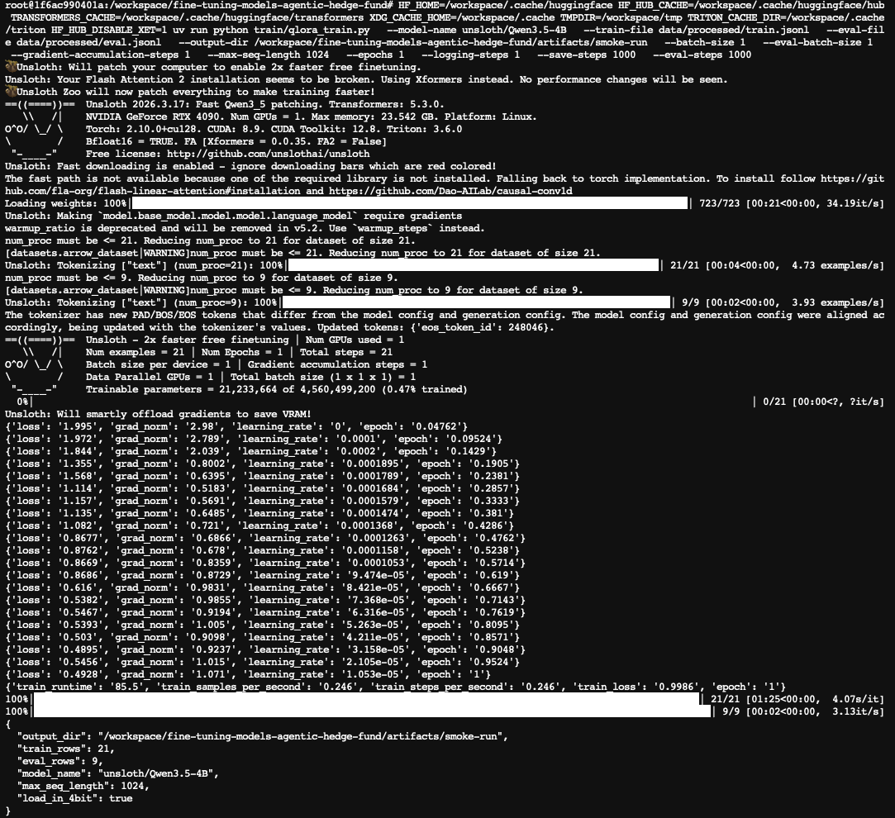
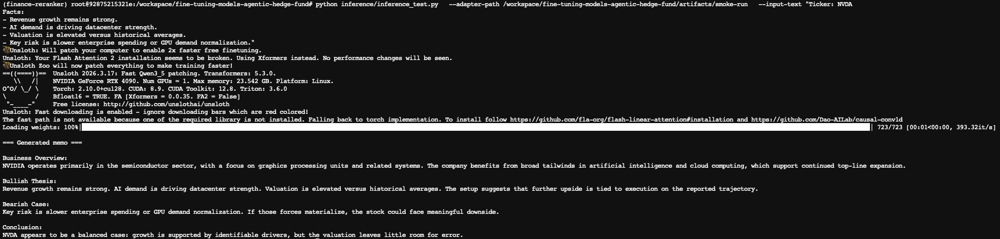

# Fine-Tuning Financial Memo Models

This repo contains two related pieces:

1. a reproducible dataset pipeline for hedge-fund style stock memo instruction tuning
2. a QLoRA training script for fine-tuning a financial memo generation model on that dataset

## Folder structure

```text
fine-tuning-models-agentic-hedge-fund/
├── data/
│   ├── raw/
│   └── processed/
├── inference/
│   └── compare.py
├── train/
│   └── qlora_train.py
├── scripts/
│   ├── build_jsonl.py
│   ├── fetch_ticker_data.py
│   └── validate_jsonl.py
├── requirements.txt
└── README.md
```

## Dataset

Processed instruction-tuning files live in:

- `data/processed/all_examples.jsonl`
- `data/processed/train.jsonl`
- `data/processed/eval.jsonl`

Each row contains:

- `instruction`
- `input`
- `output`

The target output always uses this section order:

- `Business Overview:`
- `Bullish Thesis:`
- `Bearish Thesis:`
- `Key Risks:`
- `Conclusion:`

## Training

The main training entrypoint is:

- `train/qlora_train.py`

It is designed around the Unsloth QLoRA workflow and uses the local JSONL files in `data/processed/` to fine-tune a causal language model for memo-style financial analysis.

### Example

```bash
python train/qlora_train.py \
  --model-name unsloth/Qwen3.5-4B \
  --train-file data/processed/train.jsonl \
  --eval-file data/processed/eval.jsonl \
  --output-dir artifacts/qlora-memo \
  --batch-size 2 \
  --gradient-accumulation-steps 4 \
  --epochs 3
```

The training script now formats prompts via the tokenizer chat template when available, which makes it safer to switch between chat-tuned model families such as Qwen and Llama without hardcoding model-specific special tokens.

### Local smoke test

For a quick local check with smaller memory requirements, start with a short run like this:

```bash
python train/qlora_train.py \
  --model-name unsloth/Qwen3.5-4B \
  --output-dir artifacts/qwen35-test \
  --batch-size 1 \
  --eval-batch-size 1 \
  --gradient-accumulation-steps 8 \
  --max-seq-length 1024 \
  --epochs 1
```

If your local environment struggles with 4-bit loading, you can also try `--no-load-in-4bit`, but that will increase memory usage.

### RunPod smoke test

On RunPod or similar remote GPU environments, it can help to redirect Hugging Face and temporary caches into `/workspace` so model downloads do not fill the root filesystem:

```bash
HF_HOME=/workspace/.cache/huggingface \
HF_HUB_CACHE=/workspace/.cache/huggingface/hub \
TRANSFORMERS_CACHE=/workspace/.cache/huggingface/transformers \
XDG_CACHE_HOME=/workspace/.cache \
TMPDIR=/workspace/tmp \
TRITON_CACHE_DIR=/workspace/.cache/triton \
HF_HUB_DISABLE_XET=1 \
uv run python train/qlora_train.py \
  --model-name unsloth/Qwen3.5-4B \
  --train-file data/processed/train.jsonl \
  --eval-file data/processed/eval.jsonl \
  --output-dir /workspace/fine-tuning-models-agentic-hedge-fund/artifacts/smoke-run \
  --batch-size 1 \
  --eval-batch-size 1 \
  --gradient-accumulation-steps 1 \
  --max-seq-length 1024 \
  --epochs 1 \
  --logging-steps 1 \
  --save-steps 1000 \
  --eval-steps 1000
```

This is still a real fine-tuning run, but it is intentionally small and mainly meant to confirm that the full training pipeline works end to end.

Example smoke-test output:



[Open the full-size smoke-test screenshot](./runs/smoke-test.png)

Example inference-test output:



[Open the full-size inference-test screenshot](./runs/inference-run-test.png)

### Optional exports

You can also request additional saves:

- `--save-merged-16bit`
- `--save-gguf`

## Install

```bash
pip install -r requirements.txt
```

If you are on Apple Silicon, some GPU-oriented packages may need adjustment depending on your local stack. The script is primarily aimed at CUDA environments typically used for QLoRA fine-tuning, so treat local Mac runs as smoke tests unless you have a compatible setup.

## Notes

- the current dataset is small, so overfitting is a real risk
- keep prompts grounded in the provided facts
- do not use the fine-tuned model for unsupported financial claims
